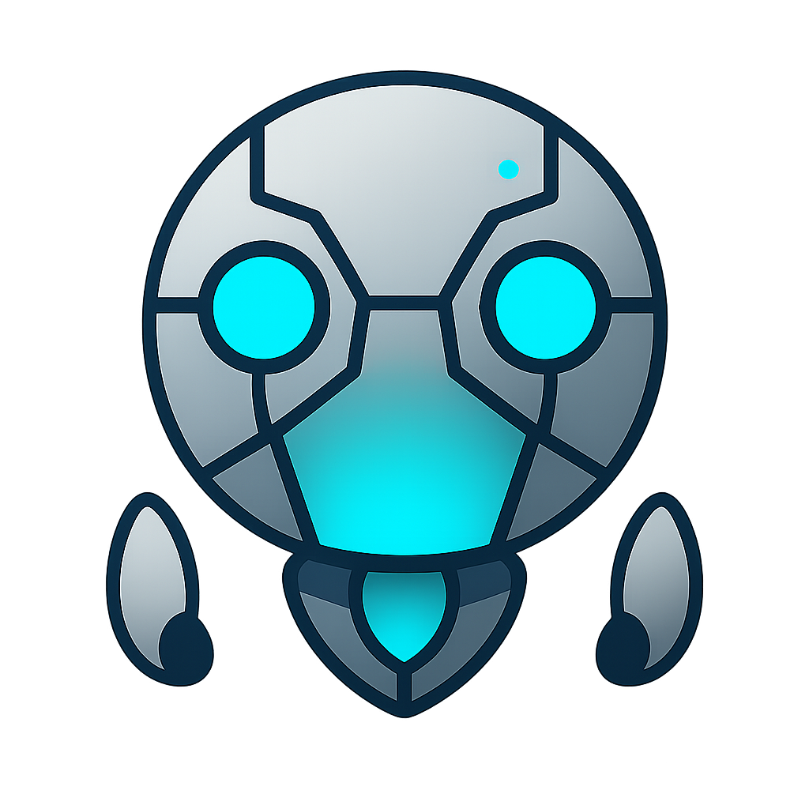

<!--
  UMS Bot Core — README
  The main README for the core-bot repository
-->

<div align="center">

  <!-- UMS Bot Core Mascot -->
  

  # UMS Bot Core

  **Minimal. Stable. Production-Ready.**

  [](https://github.com/Comradecast/tournament-bot/releases)
  [](LICENSE)
  [](https://www.python.org/downloads/)
  [](https://discordpy.readthedocs.io/)

  *A lean, predictable Discord bot for running Single Elimination tournaments.*

  [Getting Started](#-getting-started) •
  [Features](#-features) •
  [Commands](#-commands) •
  [Documentation](#-documentation) •
  [Roadmap](#-roadmap)

</div>

---

## 🎯 What is UMS Bot Core?

**UMS Bot Core** is the minimal edition of the Unified Match System — designed to be boring, predictable, and hard to break.

Perfect for:
- **Small/medium Discord servers** that want clean tournament hosting
- **Community organizers** who need something that "just works"
- **Server owners** who want a stable foundation before premium features

> 💡 **One tournament per guild. Dashboard-driven. Zero clutter.**

---

## ⚡ Features

### For Players
| Feature | Description |
|---------|-------------|
| 🎮 **One-Click Onboarding** | Set your region and rank in 30 seconds |
| 📊 **Live Dashboard** | Always know your match status |
| 🏆 **Clean Brackets** | Single Elimination, no confusion |

### For Admins
| Feature | Description |
|---------|-------------|
| ⚙️ **Quick Setup** | `/setup` creates channels automatically |
| 🔧 **Override Wizard** | Fix match results with ephemeral UI |
| 📢 **Announcement Templates** | Core Release, Patch Notes, Events |
| 🔄 **Factory Reset** | Clean wipe when needed |

### For Developers
| Feature | Description |
|---------|-------------|
| 🧪 **Dev Tools Hub** | Bracket tools, dummy entries, auto-resolve |
| 🎨 **Brand Kit** | Centralized colors, embeds, footer |
| 📖 **Full Documentation** | Architecture, UX standards, specs |

---

## 🚀 Getting Started

### Prerequisites
- Python 3.11+
- Discord Bot Token ([create one here](https://discord.com/developers/applications))

### Installation

```bash
# Clone the repository
git clone https://github.com/Comradecast/tournament-bot.git
cd tournament-bot/core-bot

# Create virtual environment
python -m venv venv
venv\Scripts\activate  # Windows
# source venv/bin/activate  # Linux/Mac

# Install dependencies
pip install -r requirements.txt

# Configure environment
cp .env.example .env
# Edit .env and add your DISCORD_TOKEN

# Run the bot
python bot.py
```

### First Run

1. Invite the bot to your server with these permissions:
   - Manage Channels
   - Manage Roles
   - Send Messages
   - Embed Links
   - Use Slash Commands

2. Run `/setup` and click **Quick Setup**

3. You're ready to host tournaments! 🎉

---

## 📋 Commands

### Player Commands
| Command | Description |
|---------|-------------|
| `/onboard` | Set up your player profile |
| `/dashboard` | View your tournament status |

### Admin Commands
| Command | Description |
|---------|-------------|
| `/setup` | Configure UMS Bot for your server |
| `/config` | View current configuration |
| `/ums-help` | Get help and command overview |
| `/tournament_create` | Create a new tournament |
| `/tournament_open_registration` | Open signups |
| `/tournament_close_registration` | Close signups |
| `/tournament_start` | Generate bracket and start |
| `/ums_report_result` | Override match results |
| `/ums_announce` | Post announcements with templates |
| `/admin_reset_player` | Reset a player's profile |
| `/ums_factory_reset` | Wipe all bot data |

### Dev Commands (gated)
| Command | Description |
|---------|-------------|
| `/ums_dev_tools` | Dev Tools Hub |
| `/ums_dev_bracket_tools` | Bracket manipulation |
| `/ums_dev_fill_dummies` | Add dummy entries |
| `/ums_dev_auto_resolve` | Auto-resolve matches |

---

## 📚 Documentation

| Document | Description |
|----------|-------------|
| [Architecture](docs/ARCHITECTURE_NOW.md) | Current system architecture |
| [Admin UX Standard](docs/ADMIN_UX_STANDARD.md) | UX rules and patterns |
| [Product Spec](docs/CORE_PRODUCT_SPEC.md) | Feature specification |
| [Dev Tools Reference](docs/DEV_TOOLS_REFERENCE.md) | Developer tool docs |
| [Release Notes](docs/RELEASE_NOTES_v1.0.0.md) | v1.0.0-core changelog |

---

## 🗺️ Roadmap

### ✅ Core v1.0.0 (Current)
- Single Elimination tournaments
- Player onboarding
- Dashboard-driven UX
- Admin override wizard
- Dev tools hub

### 🔜 Premium (Future)
- Double Elimination
- Swiss / Round Robin
- Solo Queue matchmaking
- Leaderboards & Elo display
- Recurring tournaments
- Web dashboard

> Core will always remain free and stable. Premium features extend, not replace.

---

## 🧪 Development

### Running Tests

```bash
python -m pytest tests/test_core.py -v
```

### Project Structure

```
core-bot/
├── bot.py                  # Entry point
├── database.py             # Schema + migrations
├── core_version.py         # Version constant
├── cogs/                   # Discord commands
│   ├── server_setup.py     # Setup flows
│   ├── onboarding_view.py  # Player onboarding
│   ├── tournaments.py      # Tournament management
│   └── announcements.py    # Announcement wizard
├── services/               # Business logic
├── ui/                     # Views, embeds, brand kit
└── docs/                   # Documentation
```

### Contributing

1. Fork the repository
2. Create a feature branch
3. Make your changes
4. Run tests
5. Submit a pull request

---

## 📄 License

This project is licensed under the MIT License - see the [LICENSE](LICENSE) file for details.

---

<div align="center">

  **Built with ❤️ for the competitive gaming community**

  [Invite Bot](https://discord.com/oauth2/authorize?client_id=1446358626066501703&permissions=2147559440&integration_type=0&scope=bot+applications.commands) •
  [GitHub](https://github.com/Comradecast/tournament-bot) •
  [Report Bug](https://github.com/Comradecast/tournament-bot/issues)

</div>
